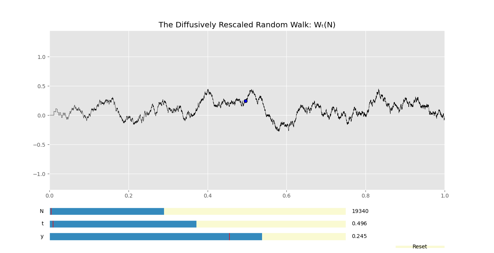

# Brownian-Motion and Friends
Brownian Motion, Wiener Processes, and Random Walks in Python. See  [my article on Brownian Motion](https://jacobbriones1.github.io/2020/10/09/BrownWiener.html ) to learn about Brownian Motion and the theory used.

## Visualization:
To use the interactive plot below, download the BrownianPy file, and run `Graphics.py`.   

